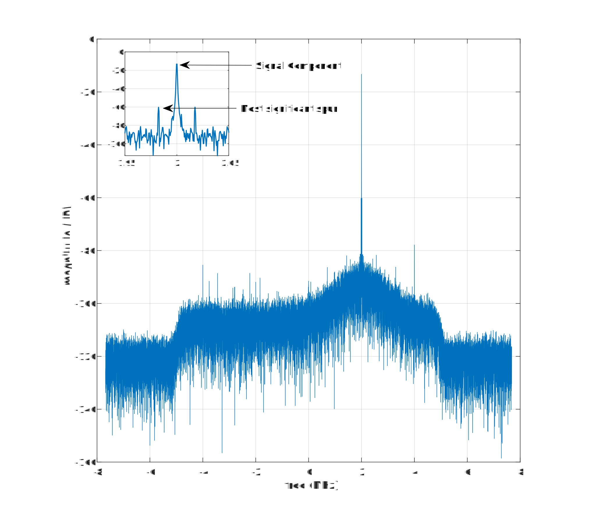
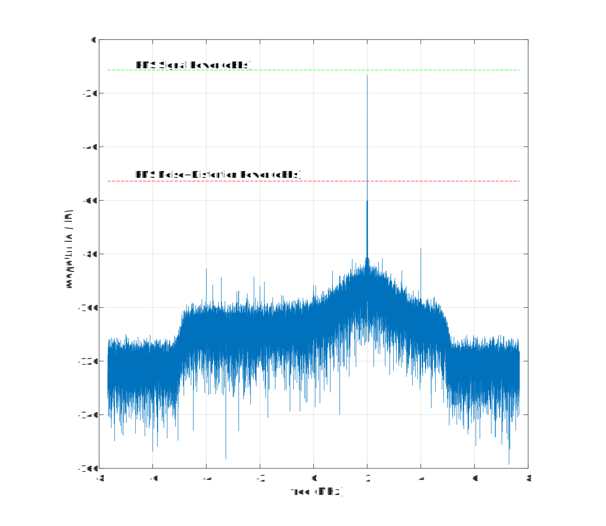
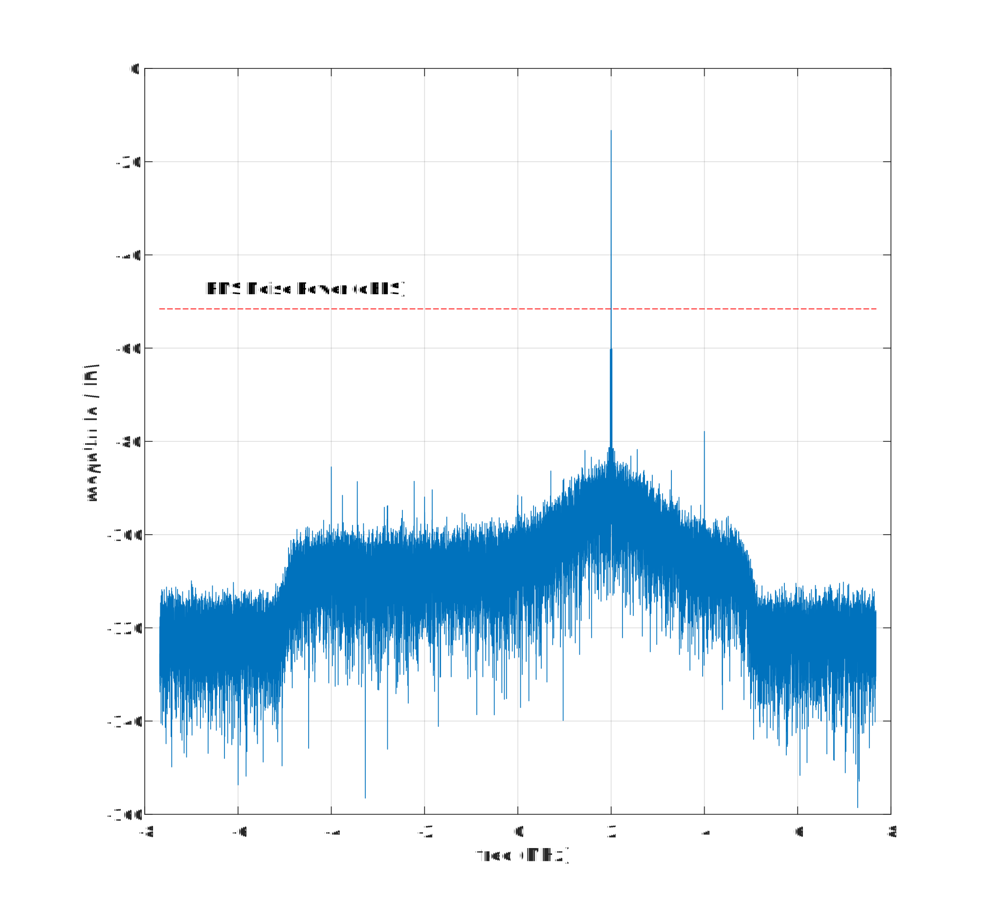
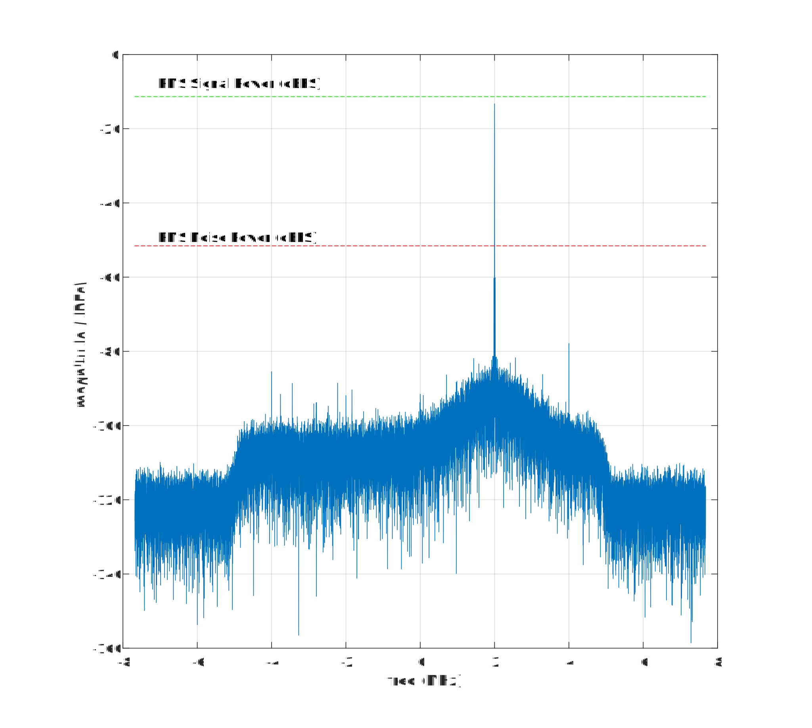
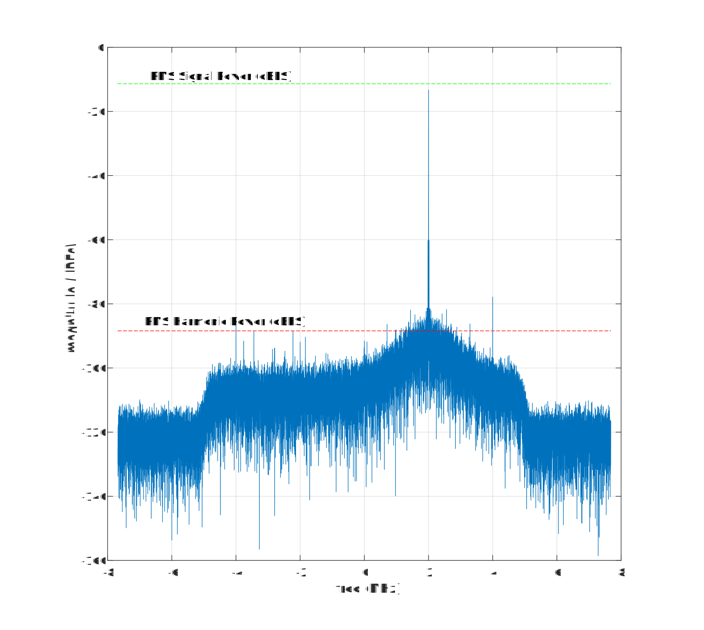

<!--- <h1>Single-Tone Tests Demonstration Using genalyzer and ADALM-PLUTO</h1> -->

A number of tests that genalyzer supports assume that the waveform that is analyzed contain one tone or two tones. genalyzer does not support analysis of generic waveforms, which can be decomposed into multiple tone frequencies. In this section, a demonstration of single-tone based measurements supported by genalyzer are described. MATLAB and Python bindings are used to describe the results using the computed FFT and its analysis. First a brief overview of configuring ADALM-PLUTO is shown. For more details, see [this](https://analogdevicesinc.github.io/TransceiverToolbox/mkdocs/streaming/) page on streaming samples from a supported device using ADI Transceiver Toolbox for MATLAB and [this](https://analogdevicesinc.github.io/pyadi-iio/buffers/index.html#buffer-examples) page for the corresponding details when using PyADI-IIO.

<h2>Configuring ADALM-PLUTO for Tone-Based Measurement in RF Loopback</h2>

An ADALM-PLUTO is connected in RF loopback and is configured to transmit a 2 MHz complex tone, with the sample rate set to 15.36 MSPS. 
<h3>MATLAB</h3>

The MATLAB and Python code snippets are shown below.

=== "MATLAB"

    ``` py
    %% Tx set up
    tx = adi.Pluto.Tx;
    tx.uri = 'ip:pluto'; 
    tx.DataSource = 'DDS';
    tx.DDSFrequencies = [2e6 2e6; 0 0]; % set DDS complex tone freq to 2 MHz 
    tx.DDSPhases = [90e3 0; 0 0]; % expressed in millidegrees
    tx.DDSScales = [1 1; 0 0];
    tx.CenterFrequency = 2.4e9;
    tx.EnableCustomFilter = true;
    tx.CustomFilterFileName = 'LTE10_MHz.ftr'; % sets PlutoSDR sample-rate to 15.36 MSPS
    tx.AttenuationChannel0 = -10;
    tx();
    pause(1);

    %% Rx set up
    rx = adi.Pluto.Rx('uri','ip:pluto');
    rx.CenterFrequency = tx.CenterFrequency;
    rx.EnableCustomFilter = true;
    rx.CustomFilterFileName = 'LTE10_MHz.ftr';
    rx.GainControlModeChannel0 = 'fast_attack';
    y = rx();
    y_re = real(y);
    y_im = imag(y);

    tx.release();
    rx.release();
    ```
=== "Python"

    ``` py
    # Create radio
    sdr = adi.Pluto()

    # Configure properties
    sdr.rx_lo = 2400000000
    sdr.tx_lo = 2400000000
    sdr.tx_cyclic_buffer = True
    sdr.tx_hardwaregain_chan0 = -10
    sdr.gain_control_mode_chan0 = "fast_attack"
    sdr.filter = "LTE10_MHz.ftr"

    fs = int(sdr.sample_rate)
    tone_freq_hz = 2000000  # In Hz
    tone_scale = 1.0  # Range: 0-1.0
    tx_channel = 0  # Starts at 0
    sdr.dds_single_tone(tone_freq_hz, tone_scale, tx_channel)

    # Collect data
    x = sdr.rx()
    ```
<h2>Using genalyzer and ADALM-PLUTO to Compute Tone-Based Measurements for ADALM-PLUTO in RF Loopback</h2>
In this section, an example on how to use genalyzer for calculating Spurious free dynamic range (SFDR) is provided. 

<h3>Spurious-Free Dynamic Range</h3>

Spurious free dynamic range (SFDR) specifies the capability of the ADC and the system to decipher a carrier signal from other noise or any other spurious frequency. It represents the smallest power signal that can be distinguished from a large interfering signal. Mathematically, it is the ratio between the root mean square (rms) value of the power of a carrier and the rms value of the next most significant spurious signal seen in the frequency domain, such as in a fast Fourier transform (FFT). Hence, by definition, this dynamic range must be free of other spurious frequencies, or spurs. 

SFDR is quantified as the range, in units of power (dBc), relative from the carrier of interest to the power of the next most significant frequency. However, it also could be referenced to a full-scale signal in units of power (dBFS). This is an important distinction since the carrier of interest may be a relatively lower power signal that is well below the full-scale input to the ADC. When this is the case, the SFDR becomes paramount in distinguishing the signal from other noise and spurious frequencies.

A harmonic frequency is an integer multiple of the fundamental frequency. Hence, the SFDR typically will be dominated by the dynamic range between a carrier frequency and the second or third harmonic of the fundamental frequency of interest. 

In this example, these ideas are demonstrated by using MATLAB's `calllib` interface to genalyzer. A link to the complete MATLAB script is shown at the bottom of this page. 

The first step is to create an opaque configuration struct. Using MATLAB and Python bindings, this is done as shown by the code snippet below. 
=== "MATLAB"
    ``` py
    % measurement settings 
    domain = 0; % 0 - TIME; 1 - FREQ
    type = 2; 
    nfft = length(y);
    navg = 1;
    fs = 15.36e6;
    fsr = 0;
    res = 12;
    window = 1; % 0 - BlackmanHarris, 1 - Hann, 2 - Rect

    % setup measurement for time-domain measurement
    c = libpointer; % create a null pointer
    calllib('libgenalyzer', 'gn_config_tone_meas', ...
        c, domain, type, nfft, navg, fs, fsr, res, window, false, false, false);
    ``` 
=== "Python"
    ``` py
    # setup measurement
    inputs = dict()
    inputs["domain_wf"] = 0
    inputs["type_wf"] = 2
    inputs["nfft"] = len(x)
    inputs["navg"] = 1
    inputs["fs"] = fs
    inputs["fsr"] = 0
    inputs["res"] = 12
    inputs["win"] = 1
    inputs["freq"] = [0]
    inputs["phase"] = [0]
    inputs["scale"] = [0]
    config_obj = genalyzer.gn_params(**inputs)
    c = genalyzer.config_tone_meas(config_obj)
    ``` 

Now, the configuration struct contains the measurement settings in order to calculate the desired metric. SFDR calculation is done as shown in the following code snippets. 
=== "MATLAB"
    ``` py
    % calculating SFDR using the time-domain waveform
    err_code = libpointer('uint32Ptr',0);
    fft_len = libpointer('uint64Ptr',0);
    metric = char('SFDR');
    fft_time_re = libpointer('doublePtrPtr', zeros(nfft, 1));
    fft_time_im = libpointer('doublePtrPtr',  zeros(nfft, 1));
    y_interleaved = [y_re'; y_im'];
    y_interleaved = y_interleaved(:);
    y_interleavedPtr = libpointer('int32Ptr', y_interleaved);
    sfdr_time = calllib('libgenalyzer', 'gn_metric', c, y_interleavedPtr, metric, fft_time_re, fft_time_im, fft_len, err_code);
    ``` 
=== "Python"
    ``` py
    # compute SFDR
    result, fft_i, fft_q, err_code = genalyzer.metric_t(c, x_intrlv, "SFDR")
    ``` 
Note that the FFT calculated for analysis and computing the desired metric is returned by genalyzer. Plotting the FFT computed using genalyzer, we can see that the second harmonic at 4 MHz and its image dominate the remaining spurs. Note that the third harmonic and its image are filtered out by the programmable filter coefficients loaded into ADALM-PLUTO. 
<figure markdown>
  { width="900" }
</figure> 

From the definition of SFDR, by examining the above plot, one can estimate SFDR to be around 50 dBc. This values agrees with the SFDR computed by genalyzer. 
``` py
SFDR (time) - 50.067584
```

Note that genalyzer can be configured to compute performance metrics from frequency-domain data as well. In other words, genalyzer can be configured to skip the FFT computation step and only perform analysis of the FFT provided as input. Note that passing a `1` instead of a `0` to the `domain` argument controls this configuration. This is shown by the MATLAB code snippet below. The same can be accomplished using Python bindings as well. 
=== "MATLAB"
    ``` py
    % setup measurement for freq-domain measurement
    c = libpointer;
    domain = 1; % 0 - TIME; 1 - FREQ
    calllib('libgenalyzer', 'gn_config_tone_meas', ...
        c, domain, type, nfft, navg, fs, fsr, res, window, false, false, false);

    % calculating SFDR using the FFT calculated from time-domain waveform
    err_code = libpointer('uint32Ptr',0);
    fft_len = libpointer('uint64Ptr',0);
    fft_y = fft(hann(length(y)).*y);
    ffty_interleaved = [real(fft_y)'; imag(fft_y).'];
    ffty_interleaved = ffty_interleaved(:);
    ffty_interleavedPtr = libpointer('doublePtr', ffty_interleaved);
    fft_freq_re = libpointer('doublePtrPtr', zeros(nfft, 1));
    fft_freq_im = libpointer('doublePtrPtr',  zeros(nfft, 1));
    sfdr_freq = calllib('libgenalyzer', 'gn_metric', c, ffty_interleavedPtr, metric, fft_freq_re, fft_freq_im, fft_len, err_code);
    ```
=== "Python"
    ``` py
    # update domain
    inputs["domain_wf"] = 1
    config_obj = genalyzer.gn_params(**inputs)
    c = genalyzer.config_tone_meas(config_obj)
    # compute SFDR
    result, fft_i, fft_q, err_code = genalyzer.metric_t(c, x_intrlv, "SFDR")
    ``` 
The calculated SFDR matches the corresponding result obtained using time-domain waveform closely.
```
SFDR (freq) - 50.067747
```

<h3>Signal-to-Noise-and-Distortion</h3>
Similarly, Signal-to-Noise-and-Distortion (SINAD, or S/(N + D) is the ratio of the rms signal amplitude to the mean value of the root-sum-square (RSS) of all other spectral components, including harmonics, but excluding DC. SINAD is therefore, an indicator of the overall dynamic performance of an ADC because it includes all components which make up noise and distortion. 

To compute SINAD using genalyzer, the measurement setup portion is similar to that of SFDR discussed in the previous section. The MATLAB and Python code snippets that compute SINAD are similar to that of SFDR and are shown below.   
=== "MATLAB"
    ``` py
    % calculating SINAD using the time-domain waveform
    err_code = libpointer('uint32Ptr',0);
    fft_len = libpointer('uint64Ptr',0);
    metric = char('SINAD');
    fft_time_re = libpointer('doublePtrPtr', zeros(nfft, 1));
    fft_time_im = libpointer('doublePtrPtr',  zeros(nfft, 1));
    y_interleaved = [y_re'; y_im'];
    y_interleaved = y_interleaved(:);
    y_interleavedPtr = libpointer('int32Ptr', y_interleaved);
    sinad_time = calllib('libgenalyzer', 'gn_metric', c, y_interleavedPtr, metric, fft_time_re, fft_time_im, fft_len, err_code);
    ``` 
=== "Python"
    ``` py
    # compute SINAD
    result, fft_i, fft_q, err_code = genalyzer.metric_t(c, x_intrlv, "SINAD")
    ```

Since SINAD includes the effect of all spectral components, excluding DC and their relative strength in reference to the signal component, we can expect SINAD to be lower than SFDR. This observation agrees with the SINAD computed by genalyzer. 
``` py
SINAD (time) - 41.452282
```
The RMS signal and noise plus distortion powers computed by genalyzer are shown in the figure below.
<figure markdown>
  { width="900" }
</figure> 

<h3>Full-Scale Signal-to-Noise Ratio</h3>
Full-Scale Signal-to-Noise Ratio (FSNR) is defined as the ratio of the full-scale input of the ADC to the mean value of the root-sum-square (RSS) of all noise components excluding other spectral components, including harmonics and DC. In genalyzer, the full-scale input of the ADC is set to 0 dB. Consequently, FSNR is a representation of the RSS of noise alone. 

Using genalyzer, the MATLAB and Python code snippets that compute FSNR are as shown below.   
=== "MATLAB"
    ``` py
    % calculating FSNR using the time-domain waveform
    err_code = libpointer('uint32Ptr',0);
    fft_len = libpointer('uint64Ptr',0);
    metric = char('FSNR');
    fft_time_re = libpointer('doublePtrPtr', zeros(nfft, 1));
    fft_time_im = libpointer('doublePtrPtr',  zeros(nfft, 1));
    y_interleaved = [y_re'; y_im'];
    y_interleaved = y_interleaved(:);
    y_interleavedPtr = libpointer('int32Ptr', y_interleaved);
    fsnr_time = calllib('libgenalyzer', 'gn_metric', c, y_interleavedPtr, metric, fft_time_re, fft_time_im, fft_len, err_code);
    ``` 
=== "Python"
    ``` py
    # compute FSNR
    result, fft_i, fft_q, err_code = genalyzer.metric_t(c, x_intrlv, "FSNR")
    ```

Since FSNR excludes the the signal component and all other resultant spectral components FSNR to be at least 10 dB higher than SINAD and approximately equal to SFDR. This observation agrees with the FSNR value computed by genalyzer. 
``` py
FSNR (time) - 51.579167
```
The RMS noise power computed by genalyzer is shown in the figure below.
<figure markdown>
  { width="900" }
</figure> 

<h3>Signal-to-Noise Ratio</h3>
Signal-to-Noise Ratio (SNR) is defined as the ratio of the root-sum-square (RSS) of the signal component to the mean value of the root-sum-square (RSS) of all noise components excluding other spectral components, including harmonics and DC. For the example we have been considering thus far, the power of signal component is approximately 13 dB. Its RSS value can be expected to be slightly lower. 

The MATLAB and Python code snippets that compute SNR are as shown below.   
=== "MATLAB"
    ``` py
    % calculating SNR using the time-domain waveform
    err_code = libpointer('uint32Ptr',0);
    fft_len = libpointer('uint64Ptr',0);
    metric = char('SNR');
    fft_time_re = libpointer('doublePtrPtr', zeros(nfft, 1));
    fft_time_im = libpointer('doublePtrPtr',  zeros(nfft, 1));
    y_interleaved = [y_re'; y_im'];
    y_interleaved = y_interleaved(:);
    y_interleavedPtr = libpointer('int32Ptr', y_interleaved);
    snr_time = calllib('libgenalyzer', 'gn_metric', c, y_interleavedPtr, metric, fft_time_re, fft_time_im, fft_len, err_code);
    ``` 
=== "Python"
    ``` py
    # compute SNR
    result, fft_i, fft_q, err_code = genalyzer.metric_t(c, x_intrlv, "SNR")
    ```

Since SNR includes the the signal component which is around 10 dB in the current example, we can expect SNR to be around 10 dB higher than FSNR and approximately equal to SINAD. This observation agrees with the FSNR value computed by genalyzer. 
``` py
SNR (time) - 41.464547
```
The RMS signal and noise powers computed by genalyzer are shown in the figure below.
<figure markdown>
  { width="900" }
</figure> 

<h3>Total Harmonic Distortion</h3>
Total harmonic distortion (THD) is the ratio of the RMS value of the fundamental signal to the mean value of the root-sum-square of its harmonics. THD of an ADC is also generally specified with the input signal close to full-scale, although it can be specified at any level.

The MATLAB and Python code snippets that compute SNR are as shown below.   
=== "MATLAB"
    ``` py
    % calculating THD using the time-domain waveform
    err_code = libpointer('uint32Ptr',0);
    fft_len = libpointer('uint64Ptr',0);
    metric = char('thd');
    fft_time_re = libpointer('doublePtrPtr', zeros(nfft, 1));
    fft_time_im = libpointer('doublePtrPtr',  zeros(nfft, 1));
    y_interleaved = [y_re'; y_im'];
    y_interleaved = y_interleaved(:);
    y_interleavedPtr = libpointer('int32Ptr', y_interleaved);
    thd_time = calllib('libgenalyzer', 'gn_metric', c, y_interleavedPtr, metric, fft_time_re, fft_time_im, fft_len, err_code);
    ``` 
=== "Python"
    ``` py
    # compute THD
    result, fft_i, fft_q, err_code = genalyzer.metric_t(c, x_intrlv, "thd")
    ```

For the ADALM-PLUTO example we have been considering thus far, the power of signal component is approximately 13 dB. By visually approximating the RSS value of the harmonics alone, the number can be approximated to be around -90 dB. Consequently, THD for the current example is around -80 dBc. This value closely matches the THD value computed by genalyzer. 
``` py
THD (time) - -77.064183
```
The RMS signal and harmonic powers computed by genalyzer are shown in the figure below.
<figure markdown>
  { width="900" }
</figure> 

<h3>Total Distortion</h3>
On the other hand, Total Distortion (TD) is the ratio of the RMS value of the fundamental signal to the mean value of the root-sum-square of its harmonics plus noise as well. 

The MATLAB and Python code snippets that compute SNR are as shown below.   
=== "MATLAB"
    ``` py
    % calculating TD using the time-domain waveform
    err_code = libpointer('uint32Ptr',0);
    fft_len = libpointer('uint64Ptr',0);
    metric = char('td');
    fft_time_re = libpointer('doublePtrPtr', zeros(nfft, 1));
    fft_time_im = libpointer('doublePtrPtr',  zeros(nfft, 1));
    y_interleaved = [y_re'; y_im'];
    y_interleaved = y_interleaved(:);
    y_interleavedPtr = libpointer('int32Ptr', y_interleaved);
    td_time = calllib('libgenalyzer', 'gn_metric', c, y_interleavedPtr, metric, fft_time_re, fft_time_im, fft_len, err_code);
    ``` 
=== "Python"
    ``` py
    # compute TD
    result, fft_i, fft_q, err_code = genalyzer.metric_t(c, x_intrlv, "td")
    ```

For the ADALM-PLUTO example we have been considering thus far, since the harmonics contribute the greatest to total distortion, the addition of noise might not signifcantly affect the computed total distortion. Hence, we observe that TD equals THD.  
``` py
TD (time) - -77.064183
```

<!--- <h1>Multi-Tone Tests</h1> -->